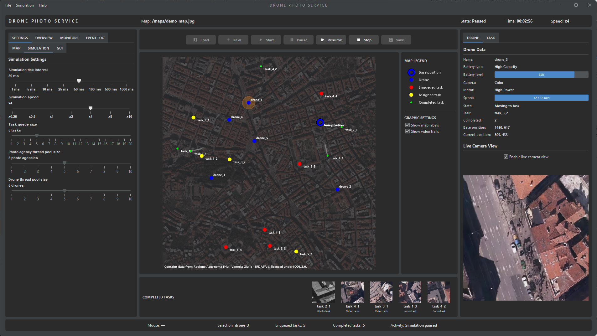
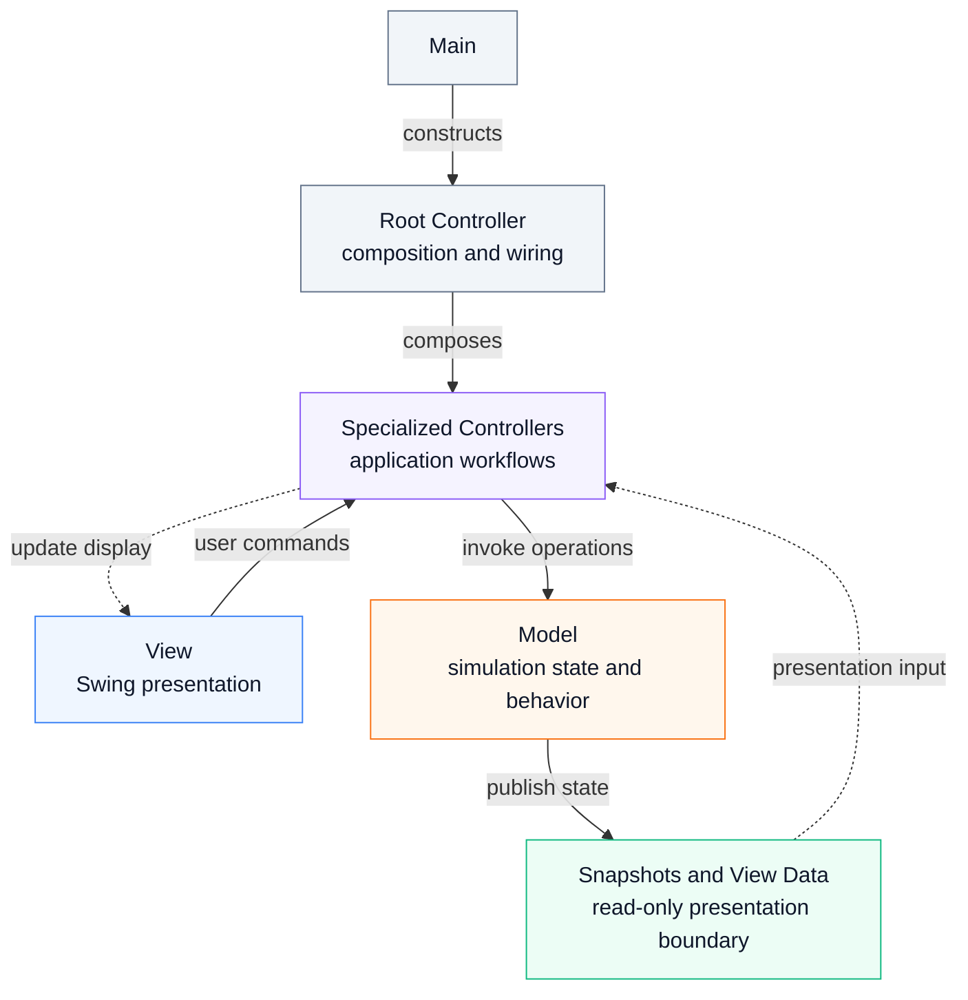

# Drone Photo Service

Drone Photo Service is a Java desktop simulation in which autonomous drones
process photo, video, and zoom tasks generated by photo agencies. Drones operate
concurrently, travel across a map, manage battery state, capture imagery, and
return completed results to their originating agencies.

The project originated as a university assignment in object-oriented programming
and was subsequently refactored and extended with a focus on architecture,
deterministic simulation, concurrency and lifecycle management, validation,
automated testing, and maintainability.

[](docs/images/animation-01-drone-photo-service.gif)

*Main simulation interface. Select the image to view the animated demonstration.*

## Overview

The simulation models a photo service in which photo agencies generate tasks and
drones compete for available work through a shared task queue. Tasks request a
photo, video, or zoom sequence at a position on the active map. Each drone has
its own motor, battery, and camera configuration, which affects its movement,
operating time, and captured imagery.

After accepting a task, a drone travels toward its target while consuming
battery power. Depending on the task type, imagery is captured either during
flight or after reaching the target. Drones return to base when necessary,
recharge automatically, and return completed results to the agency that created
the task.

The interface provides controls for configuring and running the simulation and
visualizes drone movement, task locations, capture positions, and completed
results. Individual drones and tasks can be inspected through synchronized map,
thumbnail, and detail views, while monitors and an event log expose the
simulation's ongoing activity.

## Features

- Concurrent photo agencies generating tasks for autonomous drones
- Photo, video, and zoom tasks with map-based image capture
- Drones with different motor, battery, and camera configurations
- Battery consumption, automatic return to base, and recharging
- Adjustable simulation speed with pause, resume, stop, and reset controls
- Interactive map showing drones, task locations, and capture paths
- Completed-task thumbnails, details, image sequences, and playback
- Synchronized selection between map, task results, and detail views
- Simulation monitors and event history for agencies, drones, and tasks
- Loading of custom map images with optional metadata and configurable scale
- Export of completed task imagery to disk

## Architecture

The application follows an MVC architecture with explicit boundaries between
simulation state, application workflows, and Swing presentation. The model owns
domain state and behavior, the view is responsible for graphical presentation,
and a controller layer coordinates user actions and communication between the
two. The root controller composes a set of specialized controllers rather than
implementing all application workflows itself.

Mutable simulation objects remain inside the model boundary. Controllers obtain
read-only snapshots and presentation-specific view data for GUI updates, so
Swing components do not depend directly on live drones, tasks, or mutable model
collections. This provides a clear presentation boundary between background
simulation activity and the Event Dispatch Thread.

The model uses a bounded producer-consumer queue between photo agencies and
drones, explicit drone state transitions, bounded task-result storage, and
defined lifecycle ownership for background execution. Validation, error
propagation, event logging, and automated tests provide supporting boundaries
around the simulation rather than being embedded in presentation code.



A detailed description of the application structure and its individual
subsystems is available in the [Architecture](docs/architecture.md)
documentation.

## Simulation and Concurrency

The simulation combines concurrent actors with a centralized model of simulated
time. Photo agencies produce tasks and drones consume them through a shared
bounded queue, while a periodic physics update advances movement, battery state,
task processing, and other time-dependent behavior.

> **Design scope:** Photo agencies and drones are deliberately modeled as
> independently executing actors to demonstrate Java concurrency and the
> producer-consumer pattern. This is an educational design choice rather than a
> strategy for distributing CPU workload, and the actor model is not intended as
> a scalable one-thread-per-entity architecture. Simulation timing is therefore
> kept independent of actor-thread scheduling and is controlled by the
> centralized physics update.

Simulation time is independent of wall-clock execution time. Each physics update
advances the model by an explicit time step, allowing simulation speed to be
changed without altering the underlying domain rules. Pausing stops simulated
time, and movement, battery consumption, task timestamps, processing durations,
and event timestamps all use the same temporal reference.

Actor threads are retained for work that should not block physics progression.
Photo agencies perform task-production work asynchronously, while drones use
their worker threads for operations such as image generation. Graphical refresh
runs separately on the Swing Event Dispatch Thread, so rendering frequency does
not determine simulation progress.

This separation preserves the producer-consumer concurrency of the original
project while making temporal behavior more deterministic and lifecycle
ownership more explicit. Scheduled simulation work, actor executors, and GUI
updates have defined responsibilities and can be stopped independently during
application shutdown and reset.

## Testing

The project includes a JUnit 5 test suite focused on deterministic model and
support behavior. Tests cover areas such as coordinate transformations, map and
metadata handling, simulation time, drone movement and battery behavior, state
transitions, task storage, validation, image processing, and event history.

The test strategy deliberately favors behavior that can be reproduced without
depending on Swing rendering or thread scheduling. Failure-oriented tests also
verify important invariants, including rejection of invalid input and
preservation of existing state when operations fail.

Swing presentation, visual output, and timing-dependent behavior of the complete
concurrent simulation are primarily verified through application-level testing
rather than automated GUI tests. This keeps the automated suite focused on
stable regression coverage rather than environment-dependent presentation
behavior.

A detailed description of the testing scope and its boundaries is available in
the [Testing Strategy](docs/architecture.md#testing-strategy)
documentation.

## Running the Project

### Requirements

- JDK 15 or later
- Apache Maven

The project is compiled for Java 15. Maven resolves the application and test
dependencies defined in `pom.xml`.

### Build

From the project root, compile the application and run the automated tests with:

```shell
mvn clean verify
```

The generated build output is written to `target/`.

The `verify` lifecycle also runs the project Checkstyle policy. A successful
package produces an executable JAR containing the runtime dependencies.

### Run

The application entry point is:

```text
io.github.danhjalmberg.dronephotoservice.Main
```

Run the packaged application with:

```shell
java -jar target/drone-photo-service-0.1.0-SNAPSHOT.jar
```

The application can also be run directly from an IDE using the entry point
above.

### Tests

Run the automated test suite independently with:

```shell
mvn test
```

## Documentation

Additional documentation describes the current architecture, the reasoning
behind significant design decisions, and the development of the project from the
original university submission.

- [Architecture](docs/architecture.md) - describes the current application
  structure, subsystem responsibilities, execution model, lifecycle, validation,
  event handling, and testing strategy.
- [Architecture and Design Decisions](docs/design-decisions.md) - records the
  context, alternatives, and consequences of significant architectural and
  design decisions.
- [Project Evolution](docs/project-evolution.md) - summarizes the main stages of
  refactoring and development from the original university project to the
  current implementation.

Package, class, and method API documentation is maintained as Javadoc in the
source. Generate the HTML API documentation with:

```shell
mvn javadoc:javadoc
```

The output is written to `target/site/apidocs/`. The release profile attaches a
Javadoc JAR during `mvn -Prelease package`.

The persistent source-style policy is documented in the
[Checkstyle configuration](config/checkstyle/README.md). Generate its HTML
report with `mvn checkstyle:checkstyle`; `mvn verify` enforces the adopted rules
as part of the normal build.

## Project Background

Drone Photo Service originated as the final project for a university course in
object-oriented programming. The assignment was designed to demonstrate concepts
including Swing, MVC, concurrent processing and synchronization, design
patterns, and the Java Streams API. The drone simulation was developed as a
domain in which these requirements could be combined in a single application.

The project was later revisited with a different objective. Rather than adding
features or patterns primarily for demonstration, the existing application was
reviewed as a software system and incrementally refactored. Particular attention
was given to architectural boundaries, simulation timing, concurrency and
lifecycle management, validation and error handling, automated testing, and the
separation between domain state and presentation.

The current project retains the original simulation concept and many of its
domain abstractions while substantially revising the surrounding architecture
and reliability mechanisms. A more detailed account of this development is
available in the [Project Evolution](docs/project-evolution.md) documentation.

## Technologies

- **Java 15** - language and API target
- **Swing** - desktop graphical user interface
- **Maven** - build and dependency management
- **JUnit 5** - automated testing
- **FlatLaf** - Swing look and feel
- **Jackson** - JSON map metadata parsing

## License and Attribution

The source code in this repository is licensed under the
[MIT License](LICENSE), except where otherwise noted. Third-party libraries and
data remain subject to their respective licenses.

The bundled demo map, *Demo map - Mercato Coperto, Trieste*, contains data from
Regione Autonoma Friuli Venezia Giulia - IRDATfvg and is licensed under the
Italian Open Data License 2.0 (IODL 2.0). It is derived from *True ortofoto
RAFVG 2017-2020* and has been cropped, resampled, and converted to JPEG for use
in the demo. Additional source and attribution information is stored with the
map metadata.

The project uses third-party open-source libraries including FlatLaf and
Jackson, which are distributed under the Apache License 2.0. Their respective
licenses apply independently of the license covering this project's source code.
